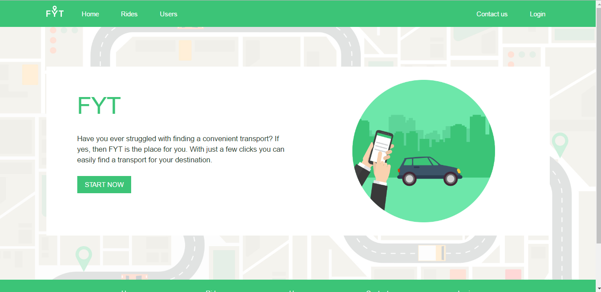
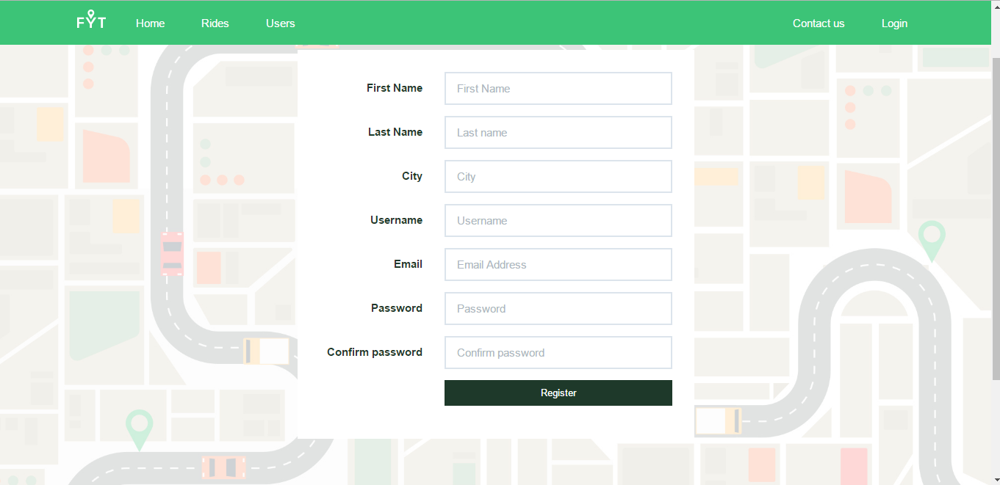
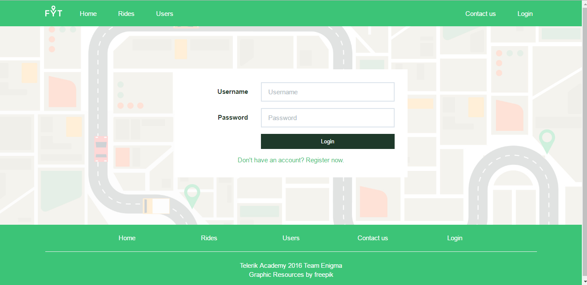
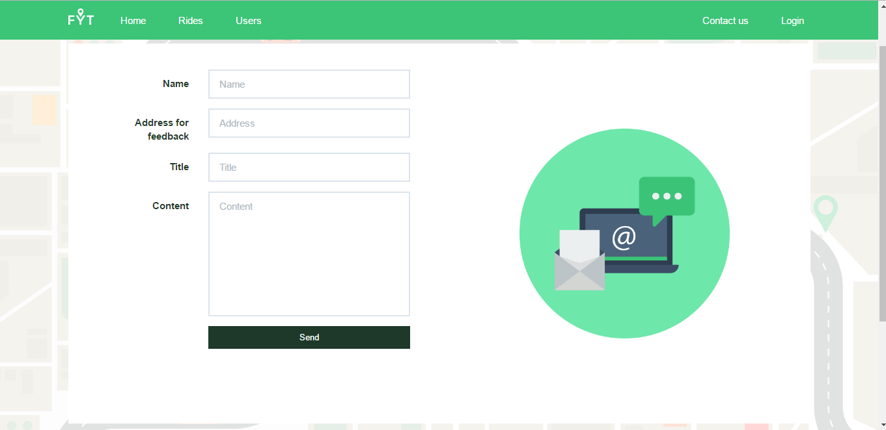

# Team Enigma

## Find Your Transport

### Team Members

* Tsvetoslav_Lazarov - Цветослав Лазаров - http://telerikacademy.com/Users/Tsvetoslav_Lazarov
* Kristina.Barutska - Кристина Барутска - http://telerikacademy.com/Users/Kristina.Barutska
* tone_92 - Антон Борисов - http://telerikacademy.com/Users/tone_92
* Enikov - Тодор Еников - https://telerikacademy.com/Users/Enikov

### Project desctiption:
* Application description - **Find Your Transport** is an application writted mainly on Javascript. It is application similar to the Facebook groups for carpool. In this application you can:
  - register
  - login 
  - add a ride, if you have a car and you are looking for someone that would like to travel with you (should be logged in) 
  - see all registered users
  - filter users and rides
  - see other users profiles (should be logged in) 
  - calculate rides price (should be logged in) 

### Images from the application:

### To start the project on your machine:
- You should have:
  - MongoDb-Server
  - Nodejs
 
1. Start mongod.exe 
2. Start the command prompt into the folder where the application is.
3. Execute the command npm install to install all needed packajes for the application.
4. Execute the command node app.js
5. The application should start on http://localhost:8080

## GitHub repository:

https://github.com/Team-Enigma
